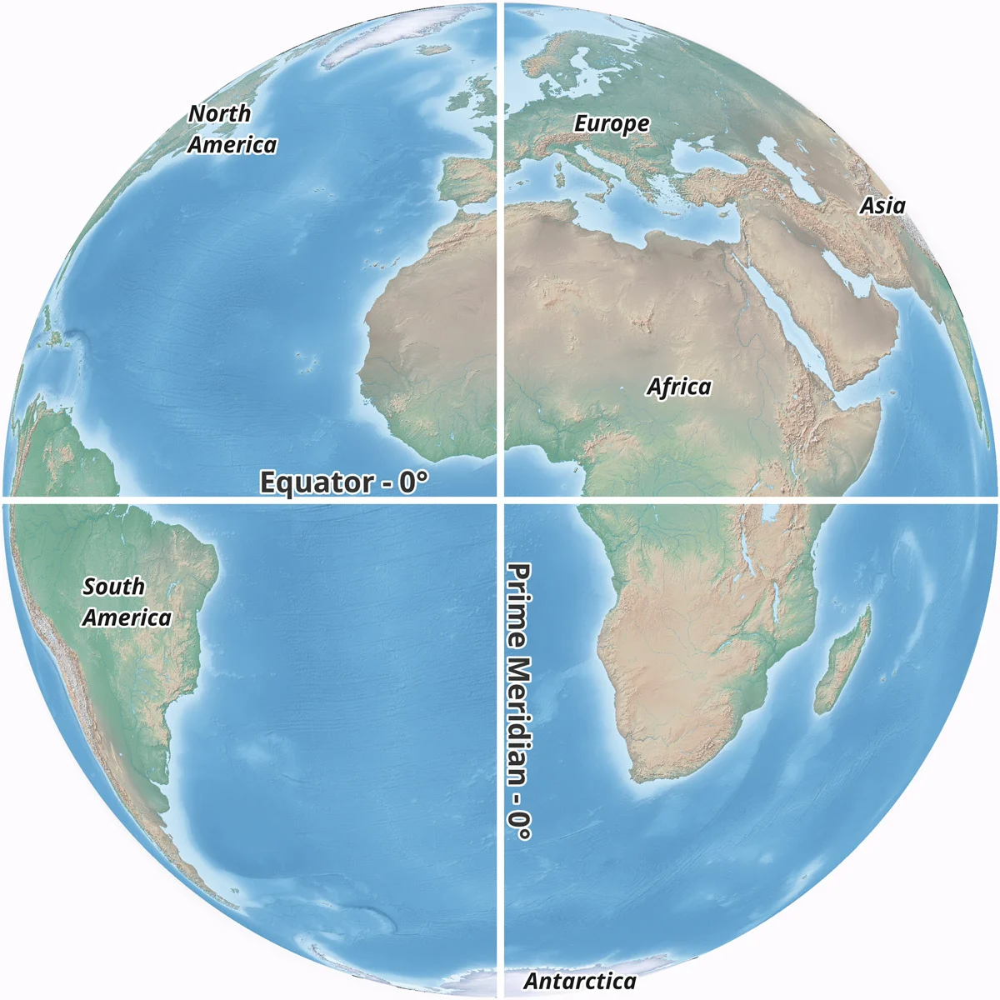

```{r setup, include=FALSE}
knitr::opts_chunk$set(echo = TRUE) 
```

# Learning Objectives

Welcome to R Geospatial Fundamentals. Our goals for today's workshop are:

1.  **Defining Geospatial data.**
2.  **Understand the structure and components of spatial dataframes and the different geometry types.**
3.  **Navigate different coordinate reference systems (CRS).**
4.  **Effectively represent data using color, symbols, and other visual elements to highlight patterns in categorical data**

------------------------------------------------------------------------

#### Throughout this workshop series, we will use the following icons:

🔔 **Question**: A quick question to help you understand what's going on.

🥊 **Challenge**: Interactive exercise. We'll go through these in the workshop!

⚠️ **Warning**: Heads-up about tricky stuff or common mistakes.

💡 **Tip**: How to do something a bit more efficiently or effectively.

📝 **Poll**: A zoom poll to help you learn.

🎬 **Demo**: Showing off something more advanced so you know what you can use R for in the future

------------------------------------------------------------------------

# **Defining Geospatial Data**

Why: Defining geospatial data establishes the basis of the type of data we are working with.

Geospatial data is information encoded with a specific location using coordinates. It is made of attributes (what), representing the data associated a particular location (where). These attributes could range from environmental factors to demographic details.

Example: Alameda High School

Attributes (what): number of students, year founded, school district etc.

Location (where): 37°45'49"N 122°14'49"W


🔔 **Question**: Is the elevation shown in the image part of the attributes or the location?

Geospatial data also often comes with additional data, metadata, that provides context. This could include information about where the geospatial data was obtained (the data source) or the date of last update of the data.

------------------------------------------------------------------------

# Examining Spatial Dataframes

Let's visualize the information contained within a spatial dataframe. We'll be using R's Simple Features package `sf`, a package designed to simplify analysis of spatial data.

```{r}

#install.packages("sf")
library(sf)
```

Let's read in the file. Note that `shp` is one of the main geospatial file types.

```{r}

schools_sf = st_read("../data/california_schools/california_schools.shp")

#data source: https://gis.data.ca.gov/datasets/f7f818b0aa7a415192eaf66f192bc9cc
```

The output you see here is metadata. We will discussmost of what is contained bit by bit throughout this workshop.

A note on filetypes: spatial data, like any other, is stored in a specific file type. The [ESRI shapefile](https://en.wikipedia.org/wiki/Shapefile) is the most widely used type of file format for storing geospatial (vector) data. It has a `.shp` file ending. This is the file we have and have read in and it is part of a collection of files, with endings `.shx`, `.dbf`, and `.prj` that need to be stored in the same location.

## What Makes a Spatial Dataframe?

Working with spatial dataframes is similar to working with base R dataframes. This allows for a more intuitive transition into geospatial analysis.

A spatial (or sf) dataframe retains all of the functionality of an R `data.frame`, extended with a `geometry` column and metadata about this column.

Let's explore some basic aspects of a spatial dataframe.

```{r}

#Look at the type of R objects an sf dataframe is 
class(schools_sf)

#Look at the size of the dataframe
dim(schools_sf) 

#View the dataframe (and see its similarities to a base R dataframe)
View(schools_sf) 

```

When referencing geospatial data (like the `schools_sf` dataframe):

-   Columns containing data are referred to as attributes .

-   Rows are referred to as features.

-   The `geometry` column provides us with spatial information for each feature.

🔔 **Question**: What is an example of an attribute in the `schools_sf` dataframe?

------------------------------------------------------------------------

# Identifying Geometry Types

There are three main types of geometries. These are distinct spatial characteristics that can be associated with a spatial dataframe. They are points, lines and polygons:


Let's look at some examples of the `geometry` column.

```{r}

#View the geometric information of this spatial dataframe 
st_geometry(schools_sf)
```

This summary includes:

-   Number of **features** (or rows)

-   The **Geometry type** of geometry---POINT---referring to the location of the schools.

-   The **Dimension** describes the data. We have 2 dimensions (2-D): the X and Y axis.

-   The **Bounding Box** refers to the outer limits in the coordinate system (XY) that contain, or bound, the data.

-   **Projected CRS** is covered in the next section

-   The geometries for the first 5 features are highlighted in red.

------------------------------------------------------------------------

## 🥊 Challenge 1: Exploring More Complex Geometry Types

We will read in the California Counties shapefile; 'CaliforniaCounties.shp' and store it as a variable 'counties'.

```{r}

counties = st_read("../data/california_counties/california_counties.shp")

```

1.  Look at the `class` and `dim` of the dataframe. `View` it as well.
2.  Identify the names of 3 columns in the dataset.
3.  Determine the geometry type.

💡 **Tip**: Geometry types (`point`, `line`, `polygon`) have their multi-equivalents (`multiline`, `multipoint`, & `multipolygon`). These account for irregular or complex shapes, disconnected or intersecting boundaries.

```{r}

# YOUR CODE HERE

#read in the counties shapefile

#look at the first few rows of the data

#identify the column names 

#identify the geometry type

```

🔔 **Question**: Why would data based on county boundaries be best represented as a multipolygon?

------------------------------------------------------------------------

# **Navigating Coordinate Reference Systems**

A coordinate reference system (CRS) is a system for associating a position on the surface of the Earth, with numerical coordinates.



There are many different CRS's and types of CRS's because the Earth is a complex surface with curvature and elevation. In representing these 3-dimensional aspects via a 2-dimensional map, some aspects become distorted. All map projections introduce some amount of distortion in **area**, **shape**, **distance** or **direction**.

Let's explore two distinct types CRS's:

------------------------------------------------------------------------

## Geographic vs. projected CRS


**Geographic Coordinate Systems...**

-   are designed to maintain the shape of continents.

-   use latitude and longitude to specify locations on the Earth's surface.

-   are suitable for global references and large-scale datasets.

-   use angular units; degrees.

**Projected Coordinate Systems...**

-   are designed for accurate representation of distances, areas, angles and shapes.

-   use x and y coordinates on a flat surface for mapping.

-   are suitable for mapping and navigation.

-   use linear units; feet, meters etc.

Various projection methods are used to preserve specific properties, such as area, shape, distance, or direction, depending on the application requirements. Let's explore some common CRS's.

### CRS Codes

CRS's are referenced by a common names and, in software, by numeric codes, often called EPSG codes.

-   Common **geographic** CRS codes include "WGS84" (EPSG 4326) and "NAD83" (EPSG 4269)\--the default for US census data.

Let's see some instances where different CRS's are used:

```{r}

#view the CRS of the spatial dataframe
st_crs(counties)
```

The first line of output tells us that the name of this CRS is NAD83. The final line tells us that the EPSG code is 4269.

```{r}

#view the CRS of the spatial dataframe
st_crs(schools_sf)
```

The first line of output tells us that the name of this CRS is WGS 84. The final line tells us that the EPSG code is 4326.

### CRS Reprojections

Let's reproject the CRS of our data such that they match and can be analyzed together. We will use the `st_transform` function to do this, and check if the CRS's are the same.

```{r}

#First, get CRS of the spatial dataframe 
st_crs(schools_sf) #WGS84
st_crs(counties) #NAD83

#Check if the CRS's are the same
st_crs(schools_sf) == st_crs(counties) 

```

We can see that the CRS's of our two objects don't match. We can use the `st_transform` function to change the CRS of one of our objects.

```{r}

#Change the CRS of the schools spatial dataframe to a different CRS based on a known EPSG code
schools_sf_4269 = st_transform(schools_sf, crs = 4269) 

st_crs(schools_sf_4269)
```

💡 **Tip**: If you don't know the EPSG code, you can set the CRS based on an existing spatial dataframe. In this case, we're setting the CRS based on the CRS of the `counties` object.

```{r}

# change the CRS of the schools spatial dataframe to match the counties dataframe
schools_sf_4269 = st_transform(schools_sf, crs=st_crs(counties))

```

------------------------------------------------------------------------

# Creating Spatial Dataframes

So far, we've dealt with 'preformatted' data, that comes as a spatial dataframe already. Let's work on creating a spatial dataframe, including assigning CRS's.

You may have spreadsheet data that needs to be converted into a spatial dataframe. Spreadsheet data, like data saved in a .csv file format, can be transformed in to a spatial dataframe given 2 pieces of information:

-   Columns that specify the geometry (e.g. point coordinates) associated with each feature.

-   The CRS of the data.

With this information, we can use the function `st_as_sf` to transform a spreadsheet data into an `sf` spatial dataframe.

```{r}

#read in a CSV file containing information on schools in Alameda county
alameda_schools_df <- read.csv("../data/alameda_schools/alameda_schools.csv")

#view the contents of the dataframe
View(alameda_schools_df)
```

```{r}

#convert the .csv into a spatial dataframe and set the CRS of the dataframe
alameda_schools_sf <- st_as_sf(alameda_schools_df, 
                       coords = c('X','Y'), #column names containing location data
                       crs = 4326) #known CRS of the data 
```

# Saving Spatial Dataframes

It's helpful to be able to save data, especially if it has been made into a spatial dataframe or transformed as we did here, in a format that streamlines continued manipulation and analysis.

The `st_write()` function is used to save spatial dataframes in the available file types (e.g. `.shp`)

```{r}

# Save to shapefile, deleting existing file if present
st_write(alameda_schools_sf, "../data/alameda_schools/alameda_schools.shp") 
```

Note that this command creates an .shp file, and that several auxiliary files (.dbf, .prj, .shx) are also created. These auxiliary files must be retained in the same folder as the .shp file.

Other geospatial file types include [.geojson](https://geojson.org/) or .[gpkg](https://www.geopackage.org/).

------------------------------------------------------------------------

# Plotting Geospatial Data

One of the most powerful characteristics of geospatial data is our ability to create spatial visualizations of attributes. This can reveal spatial patterns such as **clusters**, and spatial relationships such as **proximity**.

We'll start off using the basic `plot` function. This plots functionally all the data in the dataset.

```{r}

#plot the schools dataset
plot(schools_sf) 
```

⚠️ **Warning**: It's recommended to plot the `$geometry` column of spatial data, and not the entire dataset. The latter can take a lot of time to execute particularly for larger datasets.

## Visualizing Geometries

Let's examine the geometry of our `schools_sf` dataframe.

```{r}

#plot the grometry column of the schools_sf dataframe in purple
plot(schools_sf$geometry) 
```

🔔 **Question**: Based on this plot, can you tell what type of geometry the `schools_sf` dataframe represents (point, line, or polygon)?

Now let's do the same for our `counties`:

```{r}

#plot the grometry column of the school_sf dataframe
plot(counties$geometry) 
```

🔔 **Question**: What type of geometry does our `counties` dataframe represent (point, line, or polygon)?

## Overlay Plotting

Map overlays are a powerful method for visualizing spatial data, particularly across multiple datasets

We can create these with `plot`. The `add=TRUE` argument allows you to 'add' maps on top of one another.

Before we create the overlay plot, we should check that the CRS's of our dataframes match!

```{r}

#verify that the two datasets are in the same CRS
st_crs(schools_sf) == st_crs(counties) 
```

They don't match! Recall we created a version of the `schools_sf` dataframe that has the same CRS as the `counties` dataframe.

```{r}

#verify that the two datasets are in the same CRS
st_crs(schools_sf_4269) == st_crs(counties) 
```

⚠️ **Warning**: plotting data with mismatched CRS's can be a simple, common error. Build a habit of always checking the CRS of a dataset before doing any analysis, including plotting.

Let's create the overlay plot:

```{r}

#plot the two geometries together. Run the two lines together
plot(counties$geometry)
plot(schools_sf_4269$geometry, add=TRUE)

```

------------------------------------------------------------------------

# Creating Interactive Plots

There are other mapping packages available that allow for nuanced depictions of data, depending on the application. Let's explore a few of them.

`tmap` is one option for mapping that additionally allows for visualizing maps in both static and interactive modes. We will start by plotting a quick map using `qtm()` then toggle between static and interactive modes using `ttm()` to 'toggle the mode'.

```{r}
#install.packages("htmltools")
#install.packages("tmap") #first install the tmap package if you don't already have it

#load in the tmap package
library(tmap)
```

## Plotting Maps Using `tmap`

```{r}

# plot a 'quick tmap' using the qtm function
qtm(counties) #note that you do not have to specify that you are plotting the geometry
```

We can switch between `tmap` 's Static to Interactive mode

```{r}

# toggle the mode (or ttm!)
ttm()

#plot the counties data in 
qtm(counties) #see warning 
```

⚠️ **Warning**: Sometimes during data creation or processing, polygon geometries can gets a bit messed up. It may look great but one or more of the lines may self-intersect or not close (i.e. snap to a node). This can cause some functions to return an error message or warning. The `tmap_options` `check.and.fix` and `st_make_valid` functions repair invalid geometries so that it can render an interactive or static map properly. See the function documentation for more information.

## Repairing Invalid Geometries

```{r}

#fix the data
tmap_options(check.and.fix = TRUE)
counties<-st_make_valid(counties)
schools_sf_NAD83<-st_make_valid(schools_sf_NAD83)

#plot the repaired counties data in interactive mode
qtm(counties)

#click into one geometry and see info given
```

Some interactive features that `tmap` offer include zooming in an out, and toggling over/clicking a geometry to view its attribute data.

`tmap`, which stands for thematic maps, creates maps using using syntax similar to `ggplot2`. `tmap` plots the different geometries (points, lines, polygons) using `tm_symbols`, `tm_lines`, and `tm_polygon` respectively.`tmap` geometry functions (`tm_polygons()`, `tm_dots()`, and `tm_lines()`) allow you to plot the various geometries, and build layers onto the map.

Two main aspects of creating tailored maps using `tmap`'s are to specify the dataset in using the `tm_shape()` function, and the geometry type, for instance, using `tm_polygons()`or `tm_lines()` much like you would use the `ggplot()` to specify the data, and `geom_line()` when using the `ggplot2` package.

Let's try out the `tmap` syntax:

## Exploring more editing options in tmap

```{r}

#switch back to static mode
ttm()

# use the `tm_shape` function to create a tmap object
tm_shape(counties) +  
  tm_polygons(col = 'tan', # add the appropriage geometry, e.g.`tm_polygons` layer
              border.col = 'darkgreen', #make the color of the borders green
              alpha = 0.5) # make the fill color 50% transparent
```

To plot multiple geometries in one plot, add plots together, using `+()` Let's see the syntax for this:

```{r}

tm_shape(counties) +  
  tm_polygons(col = 'tan', 
              border.col = 'darkgreen', 
              alpha = 0.5)+ #note that you use tm_shape first to call the dataset, before later calling what it is. e.g. dots or lines. Just like ggplot
  tm_shape(schools_sf_NAD83) +
  tm_dots(col = 'purple', 
          border.col = 'white', 
          border.lwd = 1, 
          size = 0.01)
```

🔔 **Question**: Notice the one school that seems to be outside of California boundaries? What is an easy way to learn more about this datum?

------------------------------------------------------------------------

# Key Points

-   What defines a spatial dataframe is that each feature (row) in the dataset, and has an associated `geometry`column that encodes the location (a point, line or polygon) over which the data stored in the columns (attributes) is applicable.
-   There are various ways to project the complex surface of the earth results in different coordinate reference systems (CRS's). Knowing the CRS of your data and which CRS's are most applicable in your given context enables accurate data manipulation and integration.
-   Visualizing spatial dataframes can reveal spatial patterns such as clusters, and spatial relationships such as proximity.
